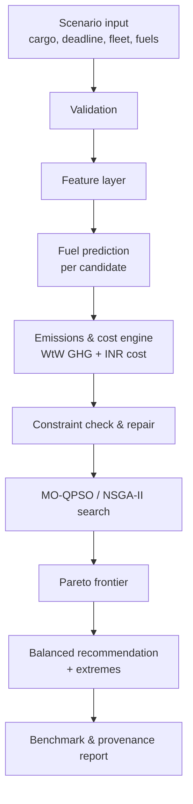
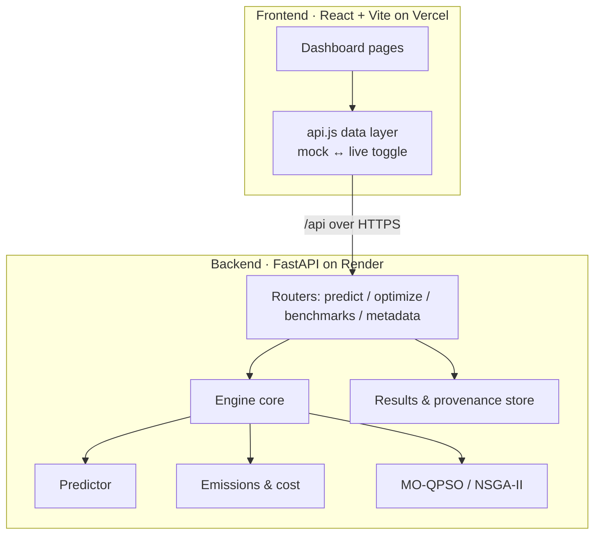

# Q-Flow

> **Quantum-Inspired Fuel Prediction & Green Fleet Optimization**
> *Predict the fuel. Price the carbon. Optimize the fleet — auditably.*
> Smart India Hackathon · Problem **SIH26138**


Q-Flow is an **auditable decision-support platform** that predicts vehicle/vessel
fuel consumption, prices the lifecycle emissions and operating cost of each fuel
pathway, and runs a **quantum-inspired multi-objective optimizer** to choose a
feasible, Pareto-optimal fleet deployment — which vessels, at what speeds, on
which fuels, with shore-power on or off. Every recommendation is benchmarked
against NSGA-II / classical PSO under reproducible, seed-pinned scenarios.

---

## 📘 Handbook — start here

The authoritative, code-verified reference lives in [`handbook/`](handbook/):

| Doc | What's inside |
|-----|---------------|
| [00 · Start here](handbook/00-START-HERE.md) | How the docs fit together, reading order |
| [01 · Overview](handbook/01-OVERVIEW.md) | Problem, solution, guiding principles |
| [02 · Architecture](handbook/02-ARCHITECTURE.md) | System + data-flow architecture |
| [03 · Backend](handbook/03-BACKEND.md) | FastAPI app, modules, endpoints, engine |
| [04 · Frontend](handbook/04-FRONTEND.md) | React dashboard, pages, data layer |
| [05 · Models](handbook/05-MODELS.md) | Prediction, emissions, optimizer |
| [06 · Data & provenance](handbook/06-DATA-AND-PROVENANCE.md) | Datasets, governance, labels |
| [07 · Dev setup](handbook/07-DEV-SETUP.md) | Local install & run |
| [08 · Deployment](handbook/08-DEPLOYMENT.md) | Render + Vercel, env, wiring |
| [09 · Security & integrity](handbook/09-SECURITY-AND-INTEGRITY.md) | CORS/auth, data-integrity rules |

## Claim labels

To keep this honest, statements are tagged:

- **`PS-FACT`** — taken from the SIH26138 problem statement.
- **`IMPLEMENTED`** — built and present in this codebase.
- **`VERIFIED METRIC`** — a measured number traceable to a recorded experiment (seed, dataset, model version).
- **`DATA-DEPENDENT`** — works when the datasets / live backend are present; degrades to representative data otherwise.
- **`DESIGN`** — a team architecture/design decision.
- **`REFERENCE`** — grounded in an external, cited source.

## 📑 Table of contents

1. [Overview](#1-overview) · 2. [Problem statement](#2-problem-statement) · 3. [Proposed solution](#3-proposed-solution) · 4. [Objectives](#4-objectives)
5. [Key features](#5-key-features) · 6. [Innovation](#6-innovation--uniqueness) · 7. [Users](#7-target-users--stakeholders) · 8. [Workflow](#8-system-workflow)
9. [Architecture](#9-system-architecture) · 10. [Tech stack](#10-technology-stack) · 11. [The three models](#11-the-three-models) · 12. [Multi-modal](#12-multi-modal-ship--road)
13. [Project structure](#13-project-structure) · 14. [Installation](#14-installation) · 15. [Environment](#15-environment-variables) · 16. [Running](#16-running-the-project)
17. [Deployment](#17-deployment) · 18. [Benchmarking](#18-benchmarking--reproducibility) · 19. [Testing](#19-testing) · 20. [Limitations](#20-limitations)
21. [Future scope](#21-future-scope) · 22. [References](#22-references) · 23. [License](#23-license)

---

## 1. Overview

Shipping and road freight are under tightening decarbonization pressure (IMO GHG
strategy, FuelEU Maritime, India's net-zero commitments). Operators must choose
*how to run a fleet* — vessel mix, speed, fuel pathway, shore power — while
balancing **fuel, cost, and well-to-wake GHG**, three objectives that genuinely
conflict. Q-Flow turns that into a transparent, reproducible optimization.

**Core principle `DESIGN`:** build a scientifically credible engine behind a clear
dashboard — not a dashboard with an unproven algorithm hidden inside it. The
optimizer **always** calls the predictor and the emissions engine for every
candidate plan; it never optimizes against hard-coded fuel numbers.

> **One-sentence pitch:** *Given a cargo demand and a deadline, Q-Flow returns the
> Pareto-optimal set of feasible fleet deployments — vessels, speeds, fuels,
> shore-power — minimizing fuel, cost, and lifecycle GHG, benchmarked against
> NSGA-II.*

## 2. Problem statement

**SIH26138 — Quantum-inspired fuel prediction & green fleet optimization. `PS-FACT`**

| Requirement | Q-Flow module | Status |
|-------------|---------------|--------|
| Predict fuel consumption from operating state | Prediction model (§11) | `IMPLEMENTED` |
| Account for lifecycle (well-to-wake) emissions | Emissions & cost engine (§11) | `IMPLEMENTED` |
| Optimize fleet decisions across objectives | MO-QPSO optimizer (§11) | `IMPLEMENTED` |
| Quantum-inspired method | QPSO (hyperparameter + multi-objective search) | `IMPLEMENTED` |
| Auditable / reproducible | Provenance ledger, seed-pinned experiments | `IMPLEMENTED` |

> **Honesty note `DESIGN`:** QPSO (quantum-behaved PSO) is a classical metaheuristic
> inspired by quantum mechanics. This is **not** quantum machine learning and makes
> **no quantum-speedup claim** — it runs on classical hardware.

## 3. Proposed solution

Three cooperating components turn a scenario into an explainable recommendation:

| # | Component | Implementation | Role |
|---|-----------|----------------|------|
| 1 | **Fuel prediction** | XGBoost (QPSO-tuned) + physics baseline | Predict voyage fuel for a vessel/vehicle + operating state |
| 2 | **Emissions & cost engine** | Deterministic, versioned, unit-tested | WtT / TtW / WtW GHG, fuel + shore-power cost (INR) |
| 3 | **Fleet optimizer** | MO-QPSO, mixed-variable decoder, constraint repair, Pareto archive | Search vessel/speed/fuel/shore-power decisions |

## 4. Objectives

- Minimize **voyage fuel/energy**, **operating cost (INR)**, and **well-to-wake GHG** simultaneously. `DESIGN`
- Keep every solution **feasible** (cargo demand met, deadline/schedule honored, range/compatibility respected). `IMPLEMENTED`
- Prove the quantum-inspired optimizer against **NSGA-II and classical PSO** on equal footing. `IMPLEMENTED`
- Make every number **traceable** — sourced factors, labeled data, recorded runs. `IMPLEMENTED`

## 5. Key features

- **5.1 Multi-objective Pareto optimization** — MO-QPSO returns a frontier of non-dominated plans (fuel ↔ cost ↔ GHG), with a balanced recommendation plus cost/GHG/fuel extremes tagged. The Optimization page renders a fixed cost-vs-WtW chart with a connected trade-off line, fuel-colored selectable plans, and a baseline marker. `IMPLEMENTED`
- **5.2 Predictor-in-the-loop** — every candidate's fuel is predicted, then priced by the emissions engine; no hard-coded fuel. `IMPLEMENTED`
- **5.3 Independent benchmarking** — NSGA-II / classical PSO vs MO-QPSO over multiple seeds: hypervolume, convergence curves, scalability sweep, box plots. `IMPLEMENTED`
- **5.4 Live, recomputable benchmarks** — the Benchmarking page computes from the real engine on demand (cached, with a Recompute button). `IMPLEMENTED`
- **5.5 Provenance & experiment log** — every field tagged measured/derived/synthetic; every run recorded with seed, dataset, model version. `IMPLEMENTED`
- **5.6 Multi-modal** — the same optimizer core runs **ship** and **road** fleets, selectable from the UI. `IMPLEMENTED`

## 6. Innovation & uniqueness

- **Quantum-behaved PSO** (delta-potential-well update, no velocity term) for both hyperparameter tuning and multi-objective fleet search, benchmarked honestly against standard baselines. `DESIGN`
- **Mixed-variable decoder with constraint repair** — a continuous `[0,1]` genotype is decoded into activation / speed / fuel / shore-power and repaired to feasibility. `IMPLEMENTED`
- **Separation of concerns** — a validated physics/ML predictor drives the loop; ML models are validated separately and cross-vessel transfer is reported candidly. `DESIGN`
- **Auditability as a feature, not an afterthought** — sourced lifecycle factors, labeled data, reproducible seed-pinned runs. `DESIGN`

## 7. Target users & stakeholders

| Role | Real-world equivalent | What they get |
|------|----------------------|---------------|
| Fleet planner | Shipping / logistics operations | Feasible, cost/GHG-optimal deployment plans |
| Sustainability lead | ESG / compliance officer | Well-to-wake GHG per plan, carbon-price sensitivity |
| Analyst / researcher | Operations research | Reproducible benchmarks, provenance, exportable results |
| Evaluator / judge | SIH reviewer | Transparent claims, verifiable metrics, live demo |

## 8. System workflow



## 9. System architecture



The frontend talks to the backend only through `/api` (same-origin reverse proxy,
or `VITE_API_BASE` for a cross-host backend). See §17 and the
[deployment handbook](handbook/08-DEPLOYMENT.md).

## 10. Technology stack

| Layer | Technology | Purpose |
|-------|-----------|---------|
| Backend API | **FastAPI**, Uvicorn | REST endpoints, async request handling |
| ML / numerics | NumPy, Pandas, scikit-learn, **XGBoost**, SHAP | Prediction, feature engineering, explainability |
| Optimization | Custom **MO-QPSO**, NSGA-II / MOPSO baselines | Multi-objective search + benchmarking |
| Frontend | **React**, Vite, Recharts | Dashboard, charts, scenario builder |
| Data | CSV / Parquet / JSON; EU MRV, ERA5, GFW, VED, GLEC | Training & lifecycle factors (§11, §18) |
| Deploy | **Render** (API) + **Vercel** (static SPA) | Hosting |

## 11. The three models

**① Fuel prediction**
- **MRV fleet-intensity model** (XGBoost, QPSO-tuned, log-target): chronological 2025 holdout **R² ≈ 0.26, MAE ≈ 28.9 kg/nm `VERIFIED METRIC`**. The ~0.25 ceiling is honestly attributed to the absence of a usable ship-size feature in MRV (documented in [model-versions](docs/model-versions.md)).
- **Operational power model** (speed-resolved, Shifts benchmark; validated on real FuelCast vessels): in-domain **R² ≈ 0.98, shifted R² ≈ 0.95, sMAPE ≈ 5% `VERIFIED METRIC`**. This is the strong predictor.
- A **physics baseline** (MRV-calibrated) drives the optimizer loop so results are valid cross-vessel; ML models are validated separately. `DESIGN`

**② Emissions & cost engine** — deterministic, versioned, unit-tested. Sourced lifecycle factors (IMO MEPC.391(81), FuelEU conventions, GLEC/DEFRA for road, CEA grid factor for India). Computes WtT/TtW/WtW GHG, fuel + shore-power cost in **INR**, and an optional GHG cap. Every factor carries a provenance tag. `IMPLEMENTED`

**③ Fleet optimizer (MO-QPSO)** — quantum-behaved PSO: `x' = p ± α·|mbest − x|·ln(1/u)` (delta-potential-well, no velocity term). Mixed-variable decoder (activation/speed/fuel/shore-power), constraint repair, Pareto archive. Benchmarked against NSGA-II and classical PSO. `IMPLEMENTED`

> Full details: [algorithm](docs/algorithm.md) · [mathematical model](docs/mathematical-model.md) · [architecture](docs/architecture.md) · [handbook/05-MODELS](handbook/05-MODELS.md).

## 12. Multi-modal (ship + road)

The optimizer core is mode-agnostic. A **ship** `FleetProblem` and a **road**
`RoadFleetProblem` share the same MO-QPSO / NSGA-II optimizers, selection, and
frontend contract; the UI exposes a Ship/Road toggle. Road uses a physics-informed
surrogate calibrated to VED magnitudes, GLEC/DEFRA WtW factors, India retail fuel
prices, and EV range/grid handling. `IMPLEMENTED`

### Optimization page behavior `IMPLEMENTED`

The Optimization page presents the three decision objectives together:

- The Pareto chart uses operating cost (INR) on the x-axis and WtW GHG (tCO2e) on the y-axis.
- A line connects plans in cost order to make the trade-off frontier readable; markers remain fuel-colored and selectable so a deployment can be inspected.
- The chart includes all returned fuel pathways in its legend and tooltip, rather than requiring an axis-pair toggle.
- The Balanced selection sliders expose `Original` baseline and `Optimized` TOPSIS values for Fuel, Cost, and WtW GHG. Moving a slider recalculates the optimized value immediately.
- Displayed costs are clamped to zero or above; optimization may reduce cost but never presents a negative cost.

## 13. Project structure

```
Q-Flow/
├── backend/
│   ├── app.py                 # FastAPI entry (CORS, routers, predictor install)
│   ├── api/                   # routers + frontend-contract mappers (compat.py)
│   ├── optimization/          # fleet_engine.py, road_fleet.py, mo_qpso, nsga2
│   ├── prediction/            # physics baseline, XGBoost, power/road models, SHAP
│   ├── emissions/             # sourced factors, lifecycle, cost
│   ├── data/                  # MRV/ERA5/GFW loaders, provenance, splits, governance
│   ├── experiments/           # benchmarks + benchmark_service (live, cached)
│   ├── schemas/               # pydantic request/response
│   └── tests/                 # 53 tests
├── frontend/
│   ├── src/pages/             # Scenario, Optimization, Prediction, Benchmarking, Provenance…
│   ├── src/lib/               # api.js (mock↔live), store.jsx (mode state)
│   ├── src/components/        # charts, layout, shared UI
│   └── vercel.json            # SPA rewrites
├── docs/                      # architecture, algorithm, model-versions, provenance…
├── handbook/                  # this project's authoritative reference
├── results/metrics/           # recorded benchmark outputs
└── Makefile                   # install / train / benchmark / test / run
```

## 14. Installation

```bash
git clone https://github.com/BhavyaSoni21/Q-Flow.git
cd Q-Flow
make install          # backend (pip) + frontend (npm) deps
```
No `make`? See §16 for the direct commands.

## 15. Environment variables

| Scope | Variable | Default | Purpose |
|-------|----------|---------|---------|
| Backend | `CORS_ORIGINS` | `*` (dev) | Comma-separated allow-list of frontend origins |
| Backend (ingest, optional) | `AISSTREAM_API_KEY`, `GFW_API_TOKEN` | — | Only for re-collecting raw AIS/GFW data |
| Frontend | `VITE_USE_MOCK` | `true` | `false` → call the live backend |
| Frontend | `VITE_API_BASE` | `/api` | Absolute URL (incl. `/api`) for a cross-host backend |

> `VITE_*` are **build-time** — rebuild after changing them. The API serves all
> routes under `/api`, so `VITE_API_BASE` must end in `/api` (no trailing slash).

## 16. Running the project

```bash
make run            # FastAPI backend  → http://localhost:8000
make run-frontend   # React dev server → http://localhost:5173 (proxies /api → :8000)
```
Direct (Windows PowerShell):
```powershell
cd backend;  python -m pip install -r requirements.txt;  python -m pytest -q
python -m uvicorn app:app --port 8000
# new terminal:
cd frontend;  npm install;  npm run dev
```
The dashboard reads **live data** when `frontend/.env.local` has `VITE_USE_MOCK=false`;
otherwise it shows representative mock data.

## 17. Deployment

Q-Flow deploys as a **static SPA on Vercel** + a **FastAPI service on Render**.

**Backend (Render web service):**
- Start command: `uvicorn app:app --host 0.0.0.0 --port $PORT` (must bind `0.0.0.0` and use `$PORT`).
- Health check path: `/api/health`.
- Env: `CORS_ORIGINS=https://<your-project>.vercel.app`.

**Frontend (Vercel project):**
- Root directory: `frontend`; framework: Vite; output: `dist`.
- Env (Production + Preview): `VITE_USE_MOCK=false`, `VITE_API_BASE=https://<service>.onrender.com/api`.
- `vercel.json` provides SPA rewrites so client routes don't 404 on refresh.
- Redeploy without cache after changing env (Vite inlines `VITE_*` at build time).

> If the live fetch fails, the frontend silently falls back to representative mock
> data (watch the console for `[api] live … failed, falling back to mock`). Render's
> free tier sleeps when idle, so the first request after idle can take ~30–50s.

Full walkthrough: [handbook/08-DEPLOYMENT](handbook/08-DEPLOYMENT.md).

## 18. Benchmarking & reproducibility

- Optimizer comparison (NSGA-II / classical PSO / MO-QPSO): hypervolume mean±std, median/best/worst, feasible %, iters→95% HV, runtime. `IMPLEMENTED`
- Convergence (HV vs iteration), scalability sweep (10/25/50 units), per-seed box plots. `IMPLEMENTED`
- The Benchmarking page recomputes from the real engine on demand (cached; **Recompute** button). Prediction benchmarks retrain live when datasets are present, else serve the committed real results. `DATA-DEPENDENT`
- Protocol & integrity: [benchmark-protocol](docs/benchmark-protocol.md), [data-provenance](docs/data-provenance.md).

```bash
make benchmark      # regenerate results/metrics/
```

## 19. Testing

```bash
make test           # 53 tests  (API, engine, constraints, emissions, prediction, road, data)
```
**53 passing `VERIFIED METRIC`** — covering the emissions math, optimizer feasibility,
road fleet, API contract, and data layer.

## 20. Limitations

- MRV fleet-intensity R² is capped (~0.25) by the lack of a size feature; the strong predictor is the operational power model. `VERIFIED METRIC`
- Synthetic components (e.g. the vessel/vehicle pools, some weather scenarios) are **labeled synthetic** — not presented as measured data. `DESIGN`
- Fleet APIs support optional bearer roles; CORS defaults to open for local development. Configure QFLOW tokens and restrict CORS before public exposure (§17, handbook/09). `DESIGN`
- Road energy uses a physics surrogate calibrated to VED magnitudes, not a per-vehicle trained model in the loop. `DESIGN`

## 21. Future scope

- Real-time AIS/weather feeds into the feature layer; port-call scheduling.
- Trained per-mode predictors in the optimizer loop; uncertainty bands on recommendations.
- Authentication, multi-tenant scenarios, and persistent scenario history.
- Expanded fuel pathways and regional grid factors.

## 22. References

Lifecycle factors and data sources are cited in [docs/references.md](docs/references.md)
and tagged inline in `backend/emissions/factors.py` (IMO MEPC.391(81), FuelEU
Maritime, GLEC/DEFRA, CEA India grid factor, EU MRV, Copernicus ERA5, Global
Fishing Watch, VED). Algorithm basis: Sun et al., quantum-behaved PSO.

## 23. License

**Proprietary — All rights reserved.** Copyright (c) 2026 Q-Flow. This software and
its source, documentation, and assets are proprietary and confidential; no license
is granted. You may not use, copy, modify, distribute, or create derivative works
without prior written permission. See [`LICENSE`](LICENSE). Developed for Smart
India Hackathon (SIH26138).

---

> *Predict the fuel. Price the carbon. Optimize the fleet — auditably.*

