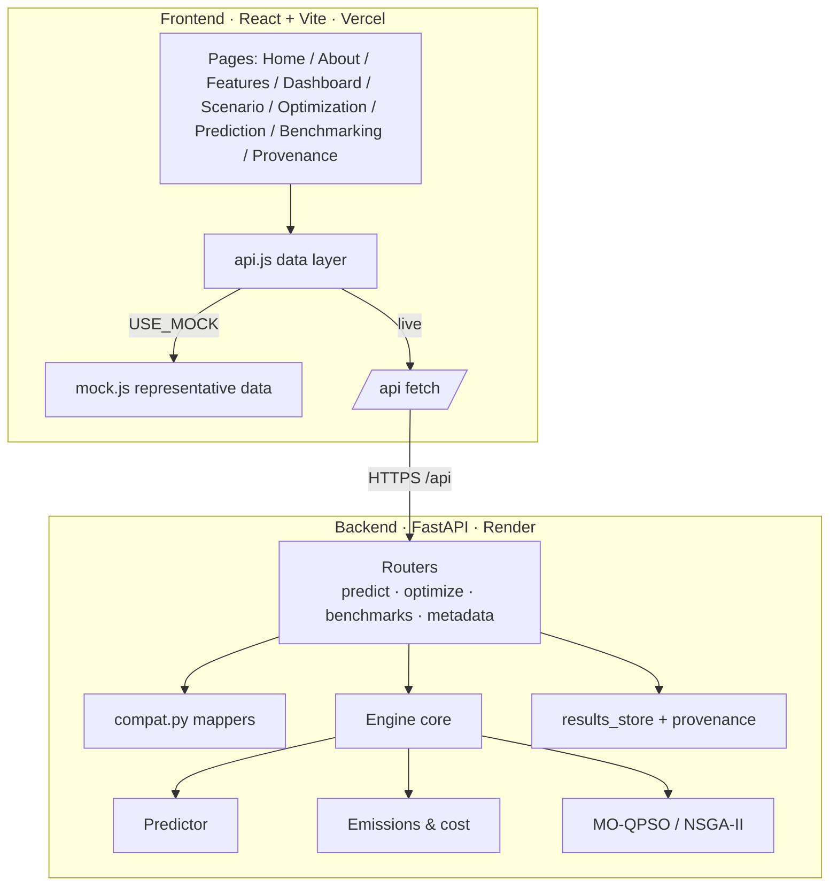

# 02 · Architecture

## Two deployables, one contract

## Request lifecycle (optimize)

1. The dashboard posts a scenario config to `POST /api/optimize/fleet` (or `/road`).
2. `compat.optimize_config_to_request` maps the UI shape → engine request.
3. The engine runs MO-QPSO/NSGA-II; **each candidate** calls the predictor +
   emissions engine; infeasible plans are repaired.
4. The run is recorded (`results_store`) with seed, pop, iters, model version.
5. `compat.optimize_result_to_frontend` maps the Pareto result → UI shape.

## Why the `/api` contract matters `DESIGN`

The frontend only ever calls `/api/...`. In dev, Vite proxies `/api → :8000`;
in prod, a same-origin reverse proxy or `VITE_API_BASE` points at Render. All
backend routers are mounted under `/api`, so a cross-host `VITE_API_BASE` must
include `/api`. See [08 · Deployment](08-DEPLOYMENT.md).

## Separation of concerns `DESIGN`

- The **physics predictor** (MRV-calibrated) drives the optimizer loop so results
  are valid across vessels; **ML models are validated separately** and swapped in
  via a pluggable predictor hook.
- The **emissions engine** is pure/deterministic and unit-tested — the optimizer
  never embeds fuel/GHG constants.
- The **optimizer core** is mode-agnostic; ship and road are two problem classes
  over the same search.

Details: [docs/architecture.md](../docs/architecture.md).
