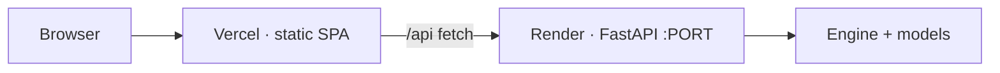

# 08 · Deployment

Q-Flow deploys as a **static SPA on Vercel** (frontend) + a **FastAPI service on
Render** (backend). They connect over HTTPS through the `/api` contract.



## Backend — Render web service

| Setting | Value |
|---------|-------|
| Build command | `pip install -r requirements.txt` (root dir `backend`) |
| **Start command** | `uvicorn app:app --host 0.0.0.0 --port $PORT` |
| Health check path | `/api/health` |
| Env | `CORS_ORIGINS=https://<your-project>.vercel.app` |
| Security env | `QFLOW_RATE_LIMIT_PER_MINUTE=120`, `QFLOW_LOG_LEVEL=INFO`, `QFLOW_SESSION_SECRET=<deployment secret>` |

> **Critical:** the start command **must** bind `0.0.0.0` and use `$PORT`. A
> hardcoded `--port 8000` (uvicorn's default host `127.0.0.1`) makes Render report
> *"No open ports detected on 0.0.0.0"* and the deploy never goes live. The running
> command is printed in the deploy log (`==> Running '...'`) — verify it matches.
> A healthy log shows `Uvicorn running on http://0.0.0.0:XXXX`.

## Frontend — Vercel project

| Setting | Value |
|---------|-------|
| Root directory | `frontend` |
| Framework / output | Vite / `dist` |
| Env (Production + Preview) | `VITE_USE_MOCK=false`, `VITE_API_BASE=https://<service>.onrender.com/api` |

- `frontend/vercel.json` rewrites non-asset paths to `index.html` (SPA routing).
- `VITE_*` are **build-time** — after changing env, **Redeploy without build cache**.
- `VITE_API_BASE` must **end in `/api`** and have **no trailing slash** (all backend
  routes are under `/api`; the frontend prepends paths that start with `/`).

## The `/api` connection, in one table

| `VITE_API_BASE` | Request becomes | Works? |
|-----------------|-----------------|--------|
| *(unset)* → `/api` | `/api/vessels` (same-origin proxy) | ✅ dev / co-hosted |
| `https://api.example.com` | `…/vessels` | ❌ 404 (missing `/api`) |
| `https://api.example.com/api` | `…/api/vessels` | ✅ |

## Verify it's connected

Open the deployed site → DevTools → Network → run an optimization. Requests should
hit `https://<service>.onrender.com/api/...` with 200s. If you see the console
warning `[api] live … failed, falling back to mock`, the connection is broken —
usual causes: missing `/api` suffix, CORS origin mismatch, or Render asleep.

> Render's free tier **sleeps when idle**; the first request after idle can take
> ~30–50s to wake. Not a bug — just warm it before a demo. `DATA-DEPENDENT`

## Local build check

```bash
cd frontend && npm run build      # must succeed before deploying
cd backend  && python -m pytest -q # current suite must be green
```

The API emits request IDs, redacted structured request logs, security headers,
and a configurable per-client rate limit. `/api/security/status` exposes only
non-secret posture flags. Send logs to the hosting provider’s retained log sink;
do not log request bodies, cookies, API keys, or authorization headers.
