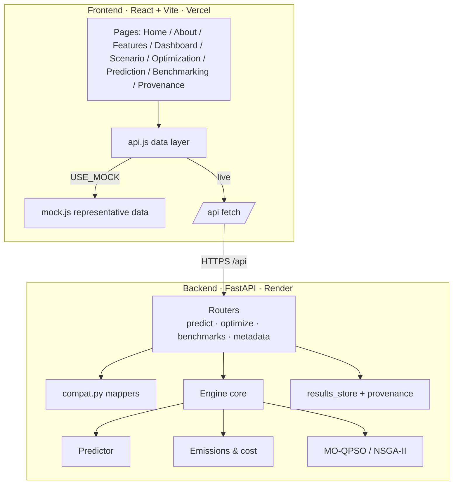

# Q-Flow · Master Handbook

**SIH26138 — Quantum-inspired fuel prediction & green fleet optimization**

This is the **single-file edition** of the Q-Flow handbook: all ten chapters
consolidated into one auditable document, with the same claim labels used in the
[README](../README.md). Hand this to a reviewer, a judge, or a new team member and
it stands alone.

- The split chapter files ([00](#00--start-here) · [01](#01--overview) · [02](#02--architecture) · [03](#03--backend) · [04](#04--frontend) · [05](#05--models) · [06](#06--data--provenance) · [07](#07--dev-setup) · [08](#08--deployment) · [09](#09--security--integrity))
  remain the chapter-of-record; this document mirrors them.
- Every number here is code- or log-verified at the time of writing. Where a
  chapter claimed a stale figure, the verified value is used and the discrepancy
  is called out in [§ Verification notes](#verification-notes).
- This file is **bidirectionally linked** with the [README](../README.md): the
  README is the front door (pitch, problem statement, feature list, stack,
  install/deploy summary), this document is its code-level counterpart.

## Related documents

| Document | Use it for |
|----------|-----------|
| [README](../README.md) | Problem statement, feature list (§5), tech stack (§10), install/run (§14–16), deployment (§17), testing (§19), [claim labels](#claim-labels) |
| [handbook/00-START-HERE.md](00-START-HERE.md) | Chapter index, reading order, deep-dive map |
| [`docs/`](../docs/) | Long-form [architecture](../docs/architecture.md), [algorithm](../docs/algorithm.md), [mathematical model](../docs/mathematical-model.md), [model versions](../docs/model-versions.md), [benchmark protocol](../docs/benchmark-protocol.md), [data provenance](../docs/data-provenance.md), [dataset layers](../docs/dataset-layers.md), [references](../docs/references.md) |
| [`SIH26138_Master_Implementation_Document.md`](../SIH26138_Master_Implementation_Document.md) | The full SIH blueprint |
| [`SIH26138 Audit Report`](../docs/qflow-sih26138-audit.md) | Independent audit of the claims in these chapters |

## Contents

| # | Chapter | What it answers |
|---|---------|-----------------|
| 00 | [Start here](#00--start-here) | How the docs fit together, reading order |
| 01 | [Overview](#01--overview) | The problem, the solution, the principles |
| 02 | [Architecture](#02--architecture) | Two deployables, request lifecycle, separation of concerns |
| 03 | [Backend](#03--backend) | FastAPI modules, every endpoint, the engine contract |
| 04 | [Frontend](#04--frontend) | Pages, data layer, charts, interaction details |
| 05 | [Models](#05--models) | Predict · price · optimize |
| 06 | [Data & provenance](#06--data--provenance) | Datasets, integrity labels, synthetic extensions |
| 07 | [Dev setup](#07--dev-setup) | Install, run, live-vs-mock, troubleshooting |
| 08 | [Deployment](#08--deployment) | Render + Vercel, the `/api` contract, verification |
| 09 | [Security & integrity](#09--security--integrity) | CORS/auth posture, secrets, fallback behavior |

**Claim labels** — `PS-FACT` · `IMPLEMENTED` · `VERIFIED METRIC` ·
`DATA-DEPENDENT` · `DESIGN` · `REFERENCE`
(see [README § Claim labels](../README.md#claim-labels)).

---

# 00 · Start here

Source: [`00-START-HERE.md`](00-START-HERE.md)

The Q-Flow **handbook** is the authoritative, code-verified reference for the
project. It explains what is actually built (not aspirational), tagged with the
same claim labels used in the [README](../README.md).

> **Single-file edition:** [`MASTER.md`](MASTER.md) consolidates all ten chapters
> into one document for hand-off, review, and judging.

## Reading order

1. [01 · Overview](01-OVERVIEW.md) — the problem, the solution, the principles.
2. [02 · Architecture](02-ARCHITECTURE.md) — how the pieces fit and how data flows.
3. [03 · Backend](03-BACKEND.md) — FastAPI app, modules, endpoints, the engine.
4. [04 · Frontend](04-FRONTEND.md) — the React dashboard and its data layer.
5. [05 · Models](05-MODELS.md) — prediction, emissions, and the optimizer.
6. [06 · Data & provenance](06-DATA-AND-PROVENANCE.md) — datasets and integrity labels.
7. [07 · Dev setup](07-DEV-SETUP.md) — run it locally.
8. [08 · Deployment](08-DEPLOYMENT.md) — Render + Vercel, env, wiring.
9. [09 · Security & integrity](09-SECURITY-AND-INTEGRITY.md) — CORS/auth and data rules.

## Deep-dive docs

The handbook summarizes; `docs/` holds the long-form references:

- [architecture.md](../docs/architecture.md), [algorithm.md](../docs/algorithm.md), [mathematical-model.md](../docs/mathematical-model.md)
- [model-versions.md](../docs/model-versions.md) — metrics and the accuracy-improvement log
- [benchmark-protocol.md](../docs/benchmark-protocol.md), [data-provenance.md](../docs/data-provenance.md)
- [dataset-layers.md](../docs/dataset-layers.md), [references.md](../docs/references.md)
- [`SIH26138_Master_Implementation_Document.md`](../SIH26138_Master_Implementation_Document.md) — the full blueprint

## Claim labels

`PS-FACT` · `IMPLEMENTED` · `VERIFIED METRIC` · `DATA-DEPENDENT` · `DESIGN` · `REFERENCE`
— defined in the [README](../README.md#claim-labels).

## One-minute mental model

> A scenario (cargo, deadline, fleet, fuels) → the optimizer proposes candidate
> deployments → each candidate's fuel is **predicted**, then **priced** for cost and
> well-to-wake GHG → infeasible plans are repaired → MO-QPSO returns a **Pareto
> frontier** → benchmarked against NSGA-II, with full provenance.

---

# 01 · Overview

Source: [`01-OVERVIEW.md`](01-OVERVIEW.md)

## The problem `PS-FACT`

Fleet operators (maritime and road) must decide **how to run a fleet** — which
units to deploy, at what speed, on which fuel, with shore power or not — under
tightening decarbonization pressure (IMO GHG strategy, FuelEU Maritime, India's
net-zero path). Fuel, operating cost, and well-to-wake GHG genuinely conflict:
the cheapest plan is rarely the greenest.

## The solution

Q-Flow (SIH26138) is an **auditable decision-support platform** with three
cooperating components:

1. **Fuel prediction** — predict voyage fuel for a unit + operating state.
2. **Emissions & cost engine** — price each plan's lifecycle GHG and INR cost.
3. **Fleet optimizer** — a quantum-inspired multi-objective search over
   activation / speed / fuel / shore-power that returns a Pareto frontier.

## Guiding principles `DESIGN`

- **Engine first, dashboard second.** A credible optimization engine behind a
  clear UI — not a UI hiding an unproven algorithm.
- **Predictor-in-the-loop.** Every candidate plan is scored by the real predictor
  and emissions engine; **no hard-coded fuel values**.
- **Honest about method.** QPSO is a *classical* metaheuristic inspired by quantum
  mechanics. No quantum ML, no quantum-speedup claim.
- **Auditability as a feature.** Sourced factors, labeled data (measured / derived
  / synthetic), reproducible seed-pinned runs, recorded experiments.
- **Benchmark fairly.** MO-QPSO is measured against NSGA-II and classical PSO over
  multiple seeds — wins *and* losses reported.

## What's built `IMPLEMENTED`

- Ship **and** road optimization sharing one optimizer core.
- Dedicated public **About** (`/about`) and **Features** (`/features`) pages with
  live capability filters and mathematical provenance.
- Deterministic, unit-tested emissions/cost engine with sourced factors (INR)
  adhering to IMO MEPC.391(81) and FuelEU Maritime standards.
- MRV fleet-intensity model + a strong operational power model ($R^2 \approx 0.98$,
  $\text{sMAPE} \approx 5\%$; see [05](#05--models)).
- Full-bleed scenario builder with sticky summary HUD, rich multi-vessel fleet
  deployment table, and full Pareto frontier analysis.
- FastAPI backend, React dashboard, **66 passing tests `VERIFIED METRIC`** (the
  chapter states 53+; see [Verification notes](#verification-notes)), live cached
  recomputable benchmarks (<1ms load time).

---

# 02 · Architecture

Source: [`02-ARCHITECTURE.md`](02-ARCHITECTURE.md)

## Two deployables, one contract



## Request lifecycle (optimize)

1. The dashboard posts a scenario config to `POST /api/optimize/fleet` (or `/road`).
2. `compat.optimize_config_to_request` maps the UI shape → engine request.
3. The engine runs MO-QPSO/NSGA-II; **each candidate** calls the predictor +
   emissions engine; infeasible plans are repaired.
4. The run is recorded (`results_store`) with seed, pop, iters, model version.
5. `compat.optimize_result_to_frontend` maps the Pareto result → UI shape.

## Why the `/api` contract matters `DESIGN`

The frontend only ever calls `/api/...`. In dev, Vite proxies `/api → :8000`;
in prod, a same-origin reverse proxy or `VITE_API_BASE` points at Render. All
backend routers are mounted under `/api`, so a cross-host `VITE_API_BASE` must
include `/api`. See [08 · Deployment](#08--deployment).

## Separation of concerns `DESIGN`

- The **physics predictor** (MRV-calibrated) drives the optimizer loop so results
  are valid across vessels; **ML models are validated separately** and swapped in
  via a pluggable predictor hook.
- The **emissions engine** is pure/deterministic and unit-tested — the optimizer
  never embeds fuel/GHG constants.
- The **optimizer core** is mode-agnostic; ship and road are two problem classes
  over the same search.

Details: [docs/architecture.md](../docs/architecture.md).

---

# 03 · Backend

Source: [`03-BACKEND.md`](03-BACKEND.md)

FastAPI app in `backend/`. Entry point: `app.py` (installs CORS from
`CORS_ORIGINS`, installs the MRV-calibrated predictor, mounts routers).

## Modules

| Dir | Responsibility |
|-----|----------------|
| `api/` | Routers + `compat.py` (engine ↔ frontend-shape mappers), `engine_state.py` (shared pool + predictor install) |
| `optimization/` | `fleet_engine.py` (ship), `road_fleet.py` (road), `mo_qpso`, `nsga2_baseline`, `selection` |
| `prediction/` | `physics_baseline.py`, XGBoost models, power/road models, `tune_qpso.py`, SHAP explainability, registry |
| `emissions/` | `factors.py` (sourced, versioned), `lifecycle.py`, `cost.py` |
| `data/` | MRV/ERA5/GFW loaders, `provenance.py`, `splits.py`, `governance.py`, `user_db.py` (SQLite), `ingest/` |
| `experiments/` | benchmark scripts + `benchmark_service.py` (live, cached recompute) |
| `schemas/` | pydantic request/response models |
| `tests/` | 66 tests `VERIFIED METRIC` |

## Endpoints (all under `/api`)

| Method · Path | Purpose |
|---------------|---------|
| `GET /api/health` | Liveness, calibration scale, pool size, and fleet-storage readiness |
| `GET /api/security/status` | Non-secret CORS, rate-limit, logging, and security-header posture |
| `GET /api/status` | Active predictor version plus fleet, factor, storage, artifact hash, and holdout-metric status |
| `GET /api/auth/session` · `POST /api/auth/logout` | Same-origin session discovery and cookie logout |
| `GET /api/fleet/storage` · `POST /api/fleet/backups` | Fleet SQLite schema status and admin-only consistent backup |
| `GET /api/models` | Model registry metadata, artifact presence, SHA-256, and holdout metrics |
| `GET /api/models/health` · `POST /api/models/{name}/archive` | Model health checks and admin-only rollback archive creation |
| `GET /api/benchmarks/confidence` | 95% confidence intervals where seed dispersion is available |
| `GET /api/digital-twins` | Fleet-level synthetic twin summaries |
| `POST /api/fuels/sensitivity` | Indicative fuel price/WtW sensitivity scenarios |
| `POST /api/compliance/annual` | Indicative year-by-year CII-style checks |
| `POST /api/eacf/evaluate` | Explicit Explainability/Accounting/Constraints/Feasibility contract |
| `POST /api/predict/fuel` | Predict fuel for a vessel + operating state |
| `GET /api/data/status` | Local MRV/ERA5/AIS/GFW availability and live credential status |
| `POST /api/compliance/cii` | Indicative operational CII-style intensity/cap calculation |
| `GET /api/digital-twins/{vessel_id}` | Synthetic telemetry summary and fuel-rate drift signal |
| `POST /api/corridors/optimize` | Synthetic port/fuel/shore-power corridor alternatives |
| `GET /api/predict/scatter` | Predicted-vs-actual points |
| `POST /api/optimize/fleet` | Ship optimization → Pareto frontier |
| `POST /api/optimize/robustness` | Monte Carlo normal/adverse/severe weather, prediction-error, fuel-price, and delay uncertainty analysis |
| `POST /api/optimize/road` | Road optimization (same contract) |
| `GET /api/optimize/runs/{id}` | Recorded run lookup |
| `GET /api/benchmarks/prediction` | Model comparison (`?force=true` recomputes) |
| `GET /api/benchmarks/optimizer` | Combined optimizer benchmark (`?force=true`) |
| `GET /api/benchmarks/{optimization,hv-curves,scalability,boxplot}` | Individual sections |
| `GET /api/vessels` · `POST/PUT/DELETE /api/vessels/{id}` · `/vessels/{id}/availability` · `/vessels/{id}/availability-history` | SQLite-backed fleet metadata, CRUD, and availability audit history |
| `GET /api/fuels/pathways` | Versioned pathway factors, provenance, and availability labels |
| `GET /api/ports` | List of known port names for the Scenario port-pair selectors |
| `GET /api/routes` | Route presets with reference distances (nm) mirroring `types.js` |
| `GET /api/provenance` · `/experiments` | Provenance ledger & run log (each run includes `originPort`/`destinationPort`) |
| `POST /api/scenarios` · `GET /api/scenarios` · `GET /api/scenarios/{id}` · `POST /api/scenarios/compare` | Persist, list, load, and compare versioned scenarios |
| `GET /api/users/profile` · `POST /api/users/profile` | View and update user profile info in the SQLite database |
| `GET /api/users/dashboard` | Fetch summarized metrics (carbon saved, scenarios run) from SQLite |
| `POST /api/users/feedback` | Record predicted vs actual fuel feedback |

## The engine contract `DESIGN`

`optimize_fleet(request, vehicles, algo, pop, iters, seed)` runs in a threadpool
(non-blocking). The optimizer calls `problem.evaluate` per candidate, which calls
the predictor + emissions engine — never a hard-coded fuel number. Results carry
objectives (fuel/energy, cost INR, WtW GHG), a feasibility flag, and a run id.

The `OptimizeRequest` schema includes optional `origin_port` and
`destination_port` fields. These are forwarded from the frontend's
`originPort`/`destinationPort` config, recorded in the run log for provenance, and
returned in `GET /api/experiments`. The `route_distance_nm` field remains
authoritative for the engine; port names are used for labeling and corridor
context only.

## Engine trust metadata `IMPLEMENTED`

`GET /api/status` and live optimization responses expose the active calibrated
predictor (`physics-mrv-cal-v1`), synthetic fleet status, representative factor
status, and persistent-file scenario storage. Clients should retain these labels
with results; they describe the evidence level of the recommendation.

## User & Scenario Storage

User profiles, scenario histories, and dashboard metrics are stored in a SQLite
database via `user_db.py`.

- **Database location:** configurable via the `QFLOW_DB_DIR` environment variable
  (defaults to `results/store`).
- **Backward compatibility:** `POST /api/scenarios` double-writes to both the
  legacy JSON `scenario_store.py` and the new SQLite `user_db.py`.

## Benchmark service `IMPLEMENTED`

`experiments/benchmark_service.py` caches results in memory with a lock. Optimizer
benchmarks compute live from the real engine on first load (and on `?force=true`);
prediction benchmarks serve the committed real results by default and retrain live
on `?force=true` **when the MRV datasets are present**.

## Run it

```bash
cd backend && python -m uvicorn app:app --port 8000
python -m pytest -q        # 66 tests
```

For the prototype telemetry predictor, regenerate the local ignored artifact with
`python prediction/train_synthetic_engine.py` from `backend/`. Without that local
artifact the API intentionally falls back to the calibrated physics predictor.

---

# 04 · Frontend

Source: [`04-FRONTEND.md`](04-FRONTEND.md)

React + Vite SPA in `frontend/`. React Router (`BrowserRouter`), Recharts for
charts, a single data layer that toggles between mock and the live backend.

## Pages (`src/pages/`)

| Page | What it does |
|------|--------------|
| `Landing.jsx` | Public portal with Hero search, In-Focus highlights, quick module grid, live AIS vessel counts, and quick-start links |
| `About.jsx` | Dedicated company, mission, and team overview (Team Egreen Quanta, SIH26138) highlighting regulatory compliance (IMO MEPC.391(81), FuelEU Maritime, CEA India grid) and scientific integrity |
| `Features.jsx` | Interactive capability showcase with categorized filters (Quantum Optimizer, Fuel AI, Lifecycle Emissions, Audit & Benchmarking) and the 5-step evaluation pipeline |
| `Dashboard.jsx` | Post-login home — fetches and displays dynamic simulation history, carbon metrics, company profile, and quick-start cards from the SQLite backend |
| `Profile.jsx` | Manage user profile settings and view account information, syncing with the SQLite backend |
| `Scenario.jsx` | Full-bleed scenario builder with sticky summary HUD; Ship/Road mode toggle; **From/To port-pair selectors**; fleet, fuels, distance, deadline, carbon price, and Monte Carlo weather/risk tests |
| `Optimization.jsx` | Run the optimizer; `DataStatus` banner; rich multi-vessel fleet deployment table, connected cost-vs-WtW Pareto frontier, balanced slider selection, and operational KPIs (INR) |
| `Prediction.jsx` | Single-prediction tool with physics sanity check, current-input explanation, global & local SHAP graphs, and holdout validation graphs |
| `Benchmarking.jsx` | Instant (<1ms precomputed) & live recomputable optimizer + prediction benchmarks with hypervolume (HV) and boxplot metrics |
| `Provenance.jsx` | Data-provenance ledger, experiment log (incl. `originPort`/`destinationPort` per run), and MRV/ERA5/AIS/GFW availability |
| `Emissions.jsx` | Lifecycle factors (WtT, TtW, WtW), OPS shore power cold-ironing calculations, plus indicative CII-style KPI check |
| Auth & Modals | User login, registration, password reset, and interactive review feedback modal |

## Data layer (`src/lib/`)

- **`api.js`** — one object with all calls. `maybeReal(path, mockFn)` fetches
  `${API_BASE}${path}` when `USE_MOCK` is false, falling back to mock on failure.
  `API_BASE = import.meta.env.VITE_API_BASE || "/api"`.
- **`store.jsx`** — global config + `mode` ("ship"/"road"); `runOptimization`
  dispatches to the ship or road endpoint based on mode. `DEFAULT_CONFIG` uses
  `originPort`/`destinationPort` instead of `routeId`. Completed runs are
  **persisted to `sessionStorage`** (key `qflow_store_v1`) so navigation between
  pages and hard refreshes do not lose a finished optimization result. The backend
  SQLite database permanently stores historical data.
- **`types.js`** — exports `PORTS` (known port names), `ROUTES` (presets with
  `{origin, destination, refDistance}`), and `getRouteDistance(origin, destination)`
  to look up reference distances. The old `routeId`-based `ROUTES` array is
  replaced.
- **`mock.js`** — representative, seeded data; `USE_MOCK = VITE_USE_MOCK !== "false"`.
- **`nav.js`** — navigation entries including the `/dashboard` and `/profile` routes.

`Scenario`, `Prediction`, and `Provenance` render the shared `DataStatus`
component. In live mode it displays the active model version and fleet-data status
returned by `/api/status`; in mock mode it labels the screen as using
representative seeded data.

## Mock ↔ live `DATA-DEPENDENT`

- Default (`VITE_USE_MOCK` unset/true): representative mock data, no backend needed.
- Live (`VITE_USE_MOCK=false`): real API calls. If a call fails, the layer
  **silently falls back to mock** and logs
  `[api] live … failed, falling back to mock` — check the console to confirm
  you're truly connected.

The banner reports the configured mode and whether the backend status endpoint
responded. Individual requests can still fall back if the backend becomes
unavailable, so live deployments should monitor the browser console and API health
endpoint.

## Charts `IMPLEMENTED`

`src/components/charts/` — `ParetoChart`, `BenchmarkCharts` (HV curve,
scalability, box plot), `PredictionCharts`. The Pareto chart uses operating cost
(INR) and WtW GHG (tCO2e) as fixed axes, connects returned plans in cost order,
and keeps fuel-colored selectable markers with fuel, cost, WtW, and feasibility
tooltips. Chart margins and axis widths reserve space for labels and tick values.
Legends sit at the top of each benchmark chart so they don't collide with x-axis
labels.

## Optimization interaction details `IMPLEMENTED`

`Optimization.jsx` keeps the balanced-selection controls tied to the current
`weightedPoint` recommendation. Each objective slider shows two values:

- `Original` — the baseline fuel, cost, or WtW GHG value.
- `Optimized` — the current TOPSIS-selected value for the active preference weights.

Changing a slider updates the optimized value without requiring a new optimization
request. Cost formatting is non-negative and uses INR values; fuel is shown in
tonnes and WtW GHG in tCO2e. The case-study buttons also update the scenario
inputs and rerun the optimizer for their respective baseline, speed, green-fleet,
and adverse-weather contexts.

The optimizer presents only plans that reduce both operating cost and WtW GHG
against the baseline. Baseline comparison deltas use `optimized − baseline`, so
negative deltas mean a reduction. Cost and emissions themselves remain nonnegative;
if a run finds no plan improving both objectives, the page reports that no
qualifying solution was found.

## Prediction graphs and validation splits `IMPLEMENTED`

The Prediction page renders:

- Global SHAP feature importance.
- Local SHAP contribution waterfall for the current input.
- Predicted-versus-actual validation points with a y=x reference line.
- Residuals against actual fuel with a zero-error reference line.

The Time holdout and Vessel holdout controls request different deterministic
prototype samples in mock mode. In live mode, the graphs use
`GET /api/predict/scatter`; if a recorded validation artifact is unavailable, the
charts show `No validation points available` instead of rendering a blank graph.

## Navigation & Layout Structure `IMPLEMENTED`

The application provides a polished dual-layer navigation experience:

- **Public layout (`LandingHeader.jsx`, `LandingFooter.jsx`)** — powers `/`,
  `/about`, and `/features` with smooth active route indicators, light/dark
  accessibility toggles, and direct links to live modules.
- **Application layout (`SiteHeader.jsx`, `SiteFooter.jsx`)** — powers
  authenticated routes with the Dashboard, Scenario builder, Insights mega-menu
  (Benchmarking, Prediction, Emissions, Provenance), user profile management, and
  logout.
- **Footers** — standardized across both layouts with regulatory compliance badges
  (IMO MEPC.391(81), FuelEU Maritime 2025/2030, ISO 19030, CEA India Grid
  710 gCO₂/kWh) and direct links to all subpages.

## Port-pair route selection `IMPLEMENTED`

The Scenario page replaces the old single `routeId` dropdown with two independent
**From / To** port selectors. Available ports are defined in `src/lib/types.js`
(`PORTS` array). When the selected pair matches a known route preset (`ROUTES`),
the distance field is auto-filled from `getRouteDistance(origin, destination)`. The
backend mirrors these presets at `GET /api/ports` and `GET /api/routes` for live
clients. The `originPort` and `destinationPort` values are forwarded with every
optimization request and recorded in the run log for provenance (see
[README §5.10](../README.md#5-key-features) and [03 · Backend](#03--backend)).

## SEO & accessibility `IMPLEMENTED`

`robots.txt`, `sitemap.xml`, and `site.webmanifest` support search indexing and
modern web standards; `vercel.json` provides SPA rewrites and serves these assets
natively. State (`store.jsx`) and auth (`AuthContext.jsx`) contexts keep
authenticated and Ship/Road mode state stable across navigation (see
[README §5.7](../README.md#5-key-features)).

## Build & run

```bash
cd frontend
npm install
npm run dev     # :5173, proxies /api → :8000
npm run build   # dist/  (reads VITE_* at build time)
```

`vercel.json` rewrites non-asset paths to `index.html` for client-side routing.

---

# 05 · Models

Source: [`05-MODELS.md`](05-MODELS.md)

Q-Flow has three models. The naming mirrors the problem statement: **predict**,
**price**, **optimize**.

## ① Fuel prediction

**MRV fleet-intensity model** — XGBoost, QPSO-tuned, log-target transform.
Chronological 2025 holdout: **R² ≈ 0.26, MAE ≈ 28.9 kg/nm `VERIFIED METRIC`**.
Beats untuned XGBoost, linear, and random forest on the same split.

> The ~0.25 R² ceiling is honestly attributed to the **absence of a usable
> ship-size feature in MRV** (confirmed by a DWT ablation). Documented in full in
> [docs/model-versions.md](../docs/model-versions.md), including the
> accuracy-improvement log (the log-target fix took R² from catastrophic-negative
> to +0.25).

**Operational power model** — speed-resolved, trained on the Shifts marine
benchmark and **validated on real FuelCast vessels**: in-domain **R² ≈ 0.98**,
shifted **R² ≈ 0.95**, **sMAPE ≈ 5% `VERIFIED METRIC`**. This is the strong
predictor; the untuned XGBoost is preferred for deployment (more robust under
distribution shift than the QPSO-tuned variant).

**Physics baseline** — an MRV-calibrated physics fuel-rate model drives the
**optimizer loop** so results are valid across vessels. ML models are validated
separately and installed via a pluggable predictor hook (`set_predictor`). `DESIGN`

## ② Emissions & cost engine `IMPLEMENTED`

Deterministic, versioned, unit-tested (`backend/emissions/`). Computes:

- **WtT / TtW / WtW GHG** per fuel pathway (gCO₂e/MJ → tonnes).
- **Fuel + shore-power cost** in **INR** (ship bunker converted at ₹83/USD; road at
  India retail).
- Optional **GHG cap** wired into the search.

Every factor carries a provenance tag — IMO MEPC.391(81), FuelEU conventions,
GLEC/DEFRA (road), CEA India grid factor (~710 gCO₂/kWh). See `factors.py`.

## ③ Fleet optimizer — MO-QPSO `IMPLEMENTED`

Quantum-behaved PSO (Sun et al.): position update
`x' = p ± α·|mbest − x|·ln(1/u)` — delta-potential-well, **no velocity term**.

- **Mixed-variable decoder**: a continuous `[0,1]` genotype → activation / speed /
  fuel / shore-power, then **constraint repair** to feasibility.
- **Pareto archive** of non-dominated plans across fuel ↔ cost ↔ GHG.
- Benchmarked against **NSGA-II** and **classical PSO (MOPSO)** over multiple seeds
  (hypervolume, convergence, scalability, box plots).

Math & pseudocode: [docs/algorithm.md](../docs/algorithm.md),
[docs/mathematical-model.md](../docs/mathematical-model.md).

---

# 06 · Data & provenance

Source: [`06-DATA-AND-PROVENANCE.md`](06-DATA-AND-PROVENANCE.md)

Data integrity is a first-class feature. Every field is labeled, every factor is
sourced, every reported number is traceable.

## Integrity commitments `DESIGN`

- Every data field is labeled **`measured`**, **`derived`**, or **`synthetic`**,
  with its source and (for derived) its formula.
- Every fuel/emissions factor is **sourced and versioned** (`emissions/factors.py`).
- Every reported metric is traceable to a **recorded experiment** (seed, dataset,
  model version) via `results_store`.
- Benchmarks use **multiple seeds** — no claims from a single lucky run.
- Synthetic components (vessel/vehicle pools, some weather scenarios) are **clearly
  labeled synthetic** and never presented as measured data.

## Datasets

| Dataset | Use | Notes |
|---------|-----|-------|
| **EU MRV** (2020–2025) | Fleet-intensity training | Annual, in-scope years; chronological + vessel holdout |
| **Copernicus ERA5** | Weather features (Indian coasts) | Added-resistance proxy |
| **Global Fishing Watch** | Vessel gross-tonnage join | ~partial coverage; size feature |
| **Shifts marine benchmark** | Power-model training | Strong predictor; distribution-shift test |
| **FuelCast (real 3-vessel)** | Power-model validation | Cross-vessel transfer reported candidly |
| **VED (road OBD)** | Road surrogate calibration | MAF-derived fuel rate |
| **GLEC / DEFRA** | Road WtW factors | Diesel/petrol/electricity |
| **Synthetic development extensions** | Uncertainty, twin, corridor, and integration testing | `Datasets/Synthetic/`; seeded fuel prices, port delays, vessel telemetry, and port network; never measured |

> Raw datasets are **not committed** (large / licensed) — they live under
> `Datasets/` locally and are git-ignored. The deployed server therefore cannot
> retrain prediction models; it serves the committed real results instead (see
> [03 · Backend](#03--backend) benchmark service). `DATA-DEPENDENT`

## Synthetic development extensions `DATA-DEPENDENT`

Run `python data/generate_synthetic_extensions.py` from `backend/` to create
`Datasets/Synthetic/fuel_prices_monthly.csv`, `port_delays.csv`,
`vessel_telemetry.csv`, `port_network.csv`, and `MANIFEST.json`. The manifest
records seed, row counts, and limitations. These files support development
calibration only; they are not measured, market-authoritative, or regulatory data.
The telemetry powers `/api/digital-twins/{vessel_id}` and the network powers
`/api/corridors/optimize`; both responses retain an explicit development-only
status.

The fuel sensitivity, annual KPI, and EACF endpoints are analytical prototype
contracts. They preserve indicative labels and must not be used as regulatory
certification without approved reference data and review.

## Provenance in the product `IMPLEMENTED`

- `GET /api/provenance` → the field-level data ledger (type, source, status, version).
- `GET /api/experiments` → the run log; each run records config JSON, seed, model
  version, runtime, hypervolume, feasibility, and (from the port-pair UI)
  **`originPort` and `destinationPort`** so each run's route context is traceable.
- The **Provenance** page renders both; click a run to inspect its full config.

## Honesty log

Scope and method decisions (multi-modal → ship-only → multi-modal; the DWT-feature
ablation; the log-target fix; the FuelCast cross-vessel finding) are recorded in
[docs/model-versions.md](../docs/model-versions.md) and
[docs/data-provenance.md](../docs/data-provenance.md).

---

# 07 · Dev setup

Source: [`07-DEV-SETUP.md`](07-DEV-SETUP.md)

## Prerequisites

- Python 3.10+ and pip
- Node.js 18+ and npm
- (Optional) `make`

## Install

```bash
git clone https://github.com/BhavyaSoni21/Q-Flow.git
cd Q-Flow
make install        # backend pip deps + frontend npm deps
```

## Run (two terminals)

```bash
# terminal 1 — backend
make run            # → http://localhost:8000  (GET /api/health to verify)

# terminal 2 — frontend
make run-frontend   # → http://localhost:5173  (Vite proxies /api → :8000)
```

Without `make` (Windows PowerShell):

```powershell
cd backend
python -m pip install -r requirements.txt
python -m uvicorn app:app --port 8000
# new terminal:
cd frontend
npm install
npm run dev
```

## Live vs mock data

The dashboard shows representative **mock** data by default. To run against the
live backend, create `frontend/.env.local`:

```
VITE_USE_MOCK=false
```

(Leave `VITE_API_BASE` unset locally — the Vite proxy handles `/api`.)

## Other make targets

```bash
make test           # 66 backend tests
make train          # train + persist prediction models  → models/
make benchmark      # regenerate benchmark results        → results/metrics/
make clean          # drop __pycache__ / .pytest_cache
```

## Troubleshooting

- **Dashboard shows mock while expecting live** — check the browser console for
  `[api] live … failed, falling back to mock`; confirm the backend is up and
  `VITE_USE_MOCK=false`.
- **Benchmarking first load is slow** — the optimizer benchmark computes live on
  first visit, then caches. Use **Recompute** to re-run.

---

# 08 · Deployment

Source: [`08-DEPLOYMENT.md`](08-DEPLOYMENT.md)

Q-Flow deploys as a **static SPA on Vercel** (frontend) + a **FastAPI service on
Render** (backend). They connect over HTTPS through the `/api` contract.


## Backend — Render web service

| Setting | Value |
|---------|-------|
| Build command | `pip install -r requirements.txt` (root dir `backend`) |
| **Start command** | `uvicorn app:app --host 0.0.0.0 --port $PORT` |
| Health check path | `/api/health` |
| Env | `CORS_ORIGINS=https://<your-project>.vercel.app` |
| Security env | `QFLOW_RATE_LIMIT_PER_MINUTE=120`, `QFLOW_LOG_LEVEL=INFO`, `QFLOW_SESSION_SECRET=<deployment secret>` |

> **Critical:** the start command **must** bind `0.0.0.0` and use `$PORT`. A
> hardcoded `--port 8000` (uvicorn's default host `127.0.0.1`) makes Render report
> *"No open ports detected on 0.0.0.0"* and the deploy never goes live. The running
> command is printed in the deploy log (`==> Running '...'`) — verify it matches.
> A healthy log shows `Uvicorn running on http://0.0.0.0:XXXX`.

## Frontend — Vercel project

| Setting | Value |
|---------|-------|
| Root directory | `frontend` |
| Framework / output | Vite / `dist` |
| Env (Production + Preview) | `VITE_USE_MOCK=false`, `VITE_API_BASE=https://<service>.onrender.com/api` |

- `frontend/vercel.json` rewrites non-asset paths to `index.html` (SPA routing).
- `VITE_*` are **build-time** — after changing env, **redeploy without build cache**.
- `VITE_API_BASE` must **end in `/api`** and have **no trailing slash** (all backend
  routes are under `/api`; the frontend prepends paths that start with `/`).

## The `/api` connection, in one table

| `VITE_API_BASE` | Request becomes | Works? |
|-----------------|-----------------|--------|
| *(unset)* → `/api` | `/api/vessels` (same-origin proxy) | ✅ dev / co-hosted |
| `https://api.example.com` | `…/vessels` | ❌ 404 (missing `/api`) |
| `https://api.example.com/api` | `…/api/vessels` | ✅ |

## Verify it's connected

Open the deployed site → DevTools → Network → run an optimization. Requests should
hit `https://<service>.onrender.com/api/...` with 200s. If you see the console
warning `[api] live … failed, falling back to mock`, the connection is broken —
usual causes: missing `/api` suffix, CORS origin mismatch, or Render asleep.

> Render's free tier **sleeps when idle**; the first request after idle can take
> ~30–50s to wake. Not a bug — just warm it before a demo. `DATA-DEPENDENT`

## Local build check

```bash
cd frontend && npm run build      # must succeed before deploying
cd backend  && python -m pytest -q # current suite must be green
```

The API emits request IDs, redacted structured request logs, security headers, and
a configurable per-client rate limit. `/api/security/status` exposes only non-secret
posture flags. Send logs to the hosting provider's retained log sink; do not log
request bodies, cookies, API keys, or authorization headers.

---

# 09 · Security & integrity

Source: [`09-SECURITY-AND-INTEGRITY.md`](09-SECURITY-AND-INTEGRITY.md)

This is a **demo/prototype**. It is honest about what is and isn't hardened.

## Current posture `DESIGN`

| Area | State | Note |
|------|-------|------|
| Authentication | Optional bearer-token roles on fleet APIs; disabled when no QFLOW tokens are configured | Set `QFLOW_VIEWER_TOKEN`, `QFLOW_OPERATOR_TOKEN`, and/or `QFLOW_ADMIN_TOKEN` before deployment; connect frontend identity to the selected token |
| CORS | `CORS_ORIGINS`, defaults to `*` | Set to the real frontend origin in production |
| Transport | HTTPS on Render + Vercel | — |
| Secrets | None required to serve | Ingest scripts read optional API keys from env |
| Input validation | pydantic schemas + engine guards | `optimize_*` never raises on bad user input |

> **Before any public exposure:** add authentication, lock `CORS_ORIGINS` to the
> known frontend origin(s), and put the API behind rate limiting. The code is
> structured to make this a configuration change, not a rewrite (see `app.py`).

Browser code must not embed bearer secrets in `VITE_*` variables. Frontend/backend
identity should use same-origin HttpOnly sessions or an external identity provider;
the frontend API layer now sends same-origin cookies with `credentials: include`.
When `QFLOW_SESSION_SECRET` is configured, the backend validates the signed
`qflow_session` cookie before applying fleet roles.

Fleet SQLite storage exposes its schema version and vessel count for readiness
checks. Admins can create consistent backups through `POST /api/fleet/backups`;
backup retention and off-host replication remain deployment responsibilities.

## Secrets handling `IMPLEMENTED`

- The serving backend needs **no secrets** — it runs offline from sourced factors
  and persisted model metadata.
- `AISSTREAM_API_KEY` / `GFW_API_TOKEN` are only for **re-collecting raw data** and
  are read from the environment / a local `.env` (git-ignored). Never commit them.
- Raw datasets and model binaries are git-ignored; only source, docs, and small
  real-result metrics files are committed.

## Data integrity `DESIGN`

The integrity rules are the project's backbone (see
[06 · Data & provenance](#06--data--provenance)):

- Fields labeled `measured` / `derived` / `synthetic`.
- Factors sourced and versioned; metrics traceable to recorded runs.
- Synthetic data labeled as such — never dressed up as real.
- Multi-seed benchmarks; wins **and** losses reported.

## Fallback behavior as a safety property `IMPLEMENTED`

If the backend is unreachable, the frontend degrades to representative mock data
instead of crashing — but it logs the fallback, so a connected deployment is
distinguishable from a degraded one. Treat a silent demo as suspect: confirm live
calls in the Network tab.

---

## Verification notes

### Numbers reconciled against code

| Item | Previously stated in | Used everywhere now | How verified |
|------|---------------------|---------------------|--------------|
| Backend test count | `01` 53+ · `03` 62 · `07` 53 · README badge/§13/§19 53 | **66** | `cd backend && python -m pytest -q --collect-only` → `66 tests collected` |
| Endpoint table duplication | `03` | Deduplicated | `GET/POST /api/fleet/storage` and `.../backups` were listed twice |

### Content synced from the chapter files

| Chapter | Change folded into this master |
|---------|-------------------------------|
| `00` | Restored the *Single-file edition* note and the *Claim labels* section |
| `01` | Full "What's built" list: `/about` + `/features` portals, MEPC.391(81)/FuelEU conformance, full-bleed scenario builder, cached <1ms benchmark load |
| `02` | Frontend page list in the architecture diagram (Home/About/Features/Dashboard/…) |
| `04` | Rewrote the pages table (Landing, About, Features, Auth & Modals, richer Scenario/Optimization/Prediction/Benchmarking/Emissions rows); added the dual-layer Navigation & Layout Structure section; refreshed the data-layer bullets |
| `01`, `03`, `07` | Test counts corrected to the verified 66 (were 53+/62/53) |
| README | Test-count claims aligned to the verified 66; `handbook/` tree note points at `MASTER.md`; master linked from the handbook table |

Everything else — the R²/MAE/sMAPE metrics, the endpoint list, and the claim
labels — is reproduced from the chapter files verbatim. If a chapter file and this
master disagree, treat the chapter file as the chapter-of-record and fix this
document; if a chapter and the README disagree, verify against the code and
reconcile both.

### Read this next

- [README](../README.md) — the project narrative, feature list, and claim labels.
- [00 · Start here](00-START-HERE.md) — chapter index and deep-dive map.
- [Audit report](../docs/qflow-sih26138-audit.md) — independent review of these claims.
